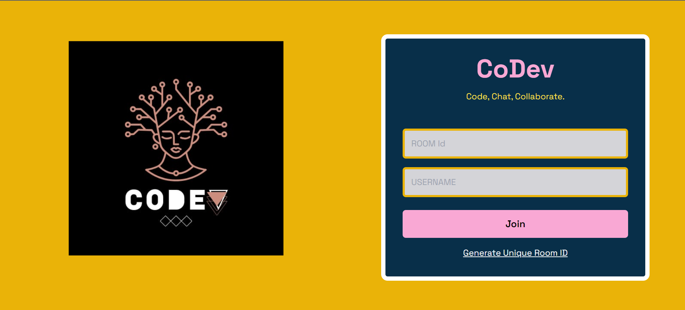

# CoDev - A Realtime Editor

CoDev is a collaborative, real-time code editor where users can seamlessly code together. It provides a platform for multiple users to enter a room, share a unique room ID, and collaborate on code simultaneously.

## 🔮 Features

-   💻 Real-time collaboration on code editing across multiple files
-   🚀 Unique room generation with room ID for collaboration
-   🌈 Syntax highlighting for various file types with auto-language detection
-   💡 Auto suggestion based on programming language
-   ⏱️ Instant updates and synchronization of code changes across all files
-   📣 Notifications for user join and leave events
-   🎨 Multiple themes for personalized coding experience
-   🌍 Comprehensive language support for versatile programming
-   🔠 Option to change font size and font family
-   👥 User presence list of users currently in the collaboration session, including online/offline status indicators
-   📁 Open, edit, save, and delete file functionalities
-   💾 Option to download files edited within the collaboration session
-   💬 **Group chatting** allows users to communicate in real-time while working on code.

## 🚀 Live Preview

You can view the live preview of the project [here](https://co-dev-one.vercel.app/).

## 💻 Tech Stack

## 🔮 Features for next release

-   **Admin Permission:** Implement an admin permission system to manage user access levels and control over certain platform features.
-   **Search and Replace:** Implement a search and replace functionality for efficient code navigation.

## 🧾 License

This project is licensed under the [MIT License](LICENSE).
